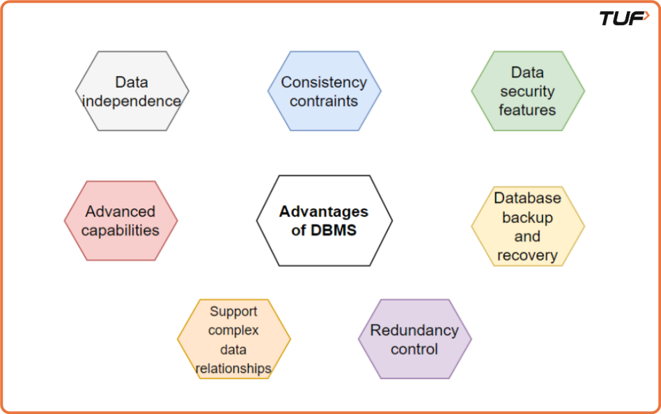
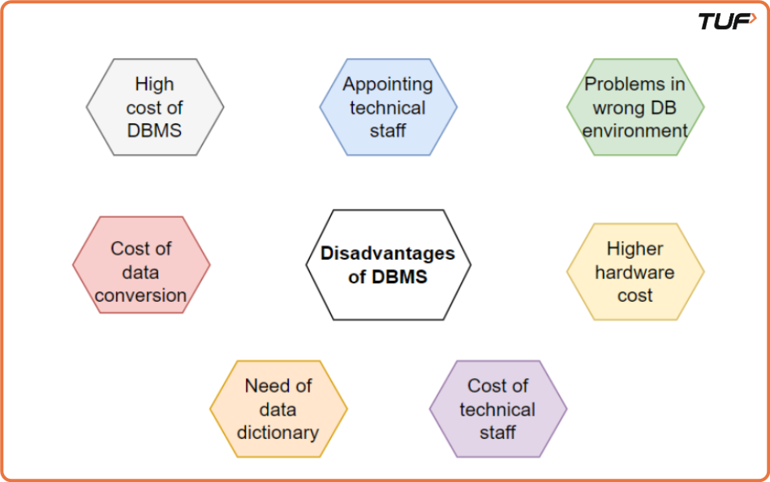
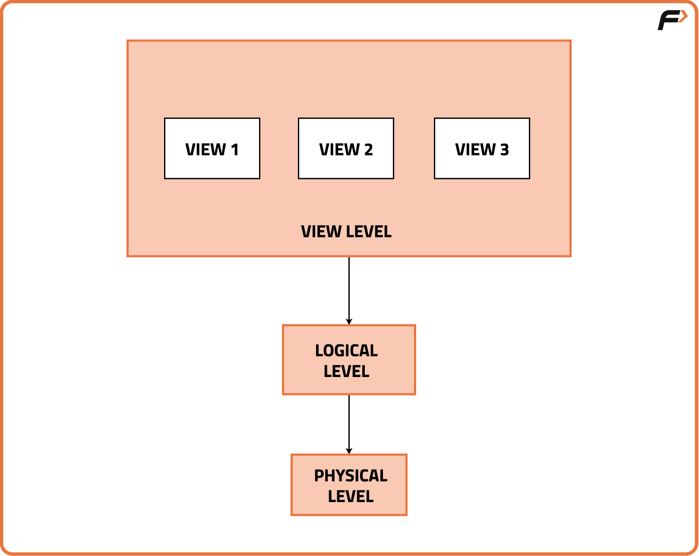

# DBMS – Day 1

## Data, Database, and File System

---

## Data

**Data** refers to a collection of raw facts or figures that can be processed to derive meaning or knowledge. It is information gathered through observations, measurements, research, or analysis.

In simple terms, data is any fact that can be stored, for example:

- "EXY"
- "12"

### Data vs Information

When data is processed, it becomes **Information**.

**Information** is the meaningful knowledge obtained by analyzing or interpreting data.

#### Examples:

- "Raj" is data when written in a register, but when it represents a person's name, it becomes information.
- The word **"orange"** is data. It can refer to:

  - A color
  - A fruit
    When specified as _color orange_ or _fruit orange_, it becomes information.

- The number **"12"** is data. It could represent:

  - Age
  - Pocket money
  - Roll number
    When stated as _Roll number 12_, it becomes information.

---

## Database

A **database** is a structured collection of interrelated data organized to enable efficient storage, retrieval, and manipulation of information.

### Characteristics of a Database:

- It is a collection of interrelated data.
- Data can be stored in the form of tables.
- Databases can be of any size.

---

## File System

A **file system** is a structure used by an operating system to manage and organize files on a storage device such as a hard drive or USB flash drive.

It defines:

- How data is organized
- How data is accessed
- How data is stored

The file system acts as an interface between the user and the stored data.

---

## Disadvantages of the File System

### 1. Data Redundancy

In traditional file systems, the same data may be stored in multiple files.

**Example:**
A company maintains separate spreadsheets for:

- Sales
- Customer contacts
- Inventory

Customer details may be entered multiple times, leading to duplication.

### 2. Poor Memory Utilization

Since the same data (such as customer names and phone numbers) is stored repeatedly across files, storage space is wasted.

### 3. Data Inconsistency

When the same data exists in multiple files, updating it in one place but not others leads to inconsistency.

**Example:**
If a customer's address is updated in the customer contacts file but not in the sales file, the data becomes inconsistent.

### 4. Data Security

File systems do not provide strong mechanisms to control access to sensitive data.

In contrast, DBMS allows controlled access by limiting who can view or modify specific data, improving security.

---

## Database Management System (DBMS)

A **Database Management System (DBMS)** is software designed to manage, manipulate, and organize large volumes of data efficiently.

It acts as an interface between:

- The database
- Users or applications

### Functions of DBMS:

- Storing data
- Retrieving data
- Updating data
- Managing data securely

---

## Real-Life Applications of DBMS

### 1. Banking Systems

Banks use DBMS to maintain centralized and secure databases of:

- Customer personal details
- Transaction history

DBMS ensures data consistency while handling millions of transactions daily.

### 2. Airline Reservation Systems

Airlines rely on DBMS to manage:

- Flight schedules
- Seat availability
- Passenger reservations

DBMS helps maintain data integrity across thousands of flights and millions of passengers.

### 3. Education Management Systems

Schools and universities use DBMS to store and manage:

- Student academic records
- Attendance details

When a new student is admitted, their information is seamlessly added to the database.

---

# DBMS – Day 2

## Types of Databases

Databases can be classified into different types based on how data is stored, structured, and accessed. Each type of database is designed to solve specific data management problems.

---

## 1. Relational Databases (RDBMS)

Relational Databases store data in the form of **tables (relations)** consisting of rows and columns. Each table has a predefined structure, and relationships between tables are defined using keys.

### Key Features:

- Data is stored in tables
- Uses rows (records) and columns (attributes)
- Relationships are maintained using primary and foreign keys
- Data manipulation is done using **SQL (Structured Query Language)**

### Examples:

- MySQL
- PostgreSQL
- Oracle Database
- Microsoft SQL Server

### Use Cases:

- Banking systems
- Student management systems
- Inventory and sales applications

---

## 2. NoSQL Databases

NoSQL databases are designed to handle **unstructured or semi-structured data** that does not fit well into traditional relational databases.

### Key Features:

- Flexible schema
- High scalability
- Suitable for big data and real-time applications

### Example:

- MongoDB (Document-Oriented Database)

### Use Cases:

- Social media platforms
- Real-time analytics
- Content management systems

---

## 3. Object-Oriented Databases

Object-Oriented Databases store data in the form of **objects**, similar to object-oriented programming concepts. Each object contains both data and the methods that operate on that data.

### Key Features:

- Supports complex data structures
- Integrates well with object-oriented languages

### Use Cases:

- Scientific simulations
- Multimedia applications
- Engineering applications

---

## 4. In-Memory Databases

In-Memory Databases store data directly in the **main memory (RAM)** instead of disk storage, which results in very fast data access.

### Key Features:

- Extremely fast data retrieval
- High performance
- Volatile storage (data may be lost on power failure unless backed up)

### Use Cases:

- Real-time data processing
- Financial trading systems
- Online gaming

---

## 5. Time-Series Databases

Time-Series Databases are optimized to store and analyze data that is **time-stamped**, meaning data points are recorded over time.

### Use Cases:

- IoT sensor data
- Stock market analysis
- System performance monitoring

---

## 6. Spatial Databases

Spatial Databases are designed to store and process **geographical and spatial data** such as maps, coordinates, and locations.

### Use Cases:

- GPS and navigation systems
- Geographic Information Systems (GIS)
- Location-based services

---

## 7. Multimedia Databases

Multimedia Databases store multimedia content such as:

- Images
- Audio
- Video
- Graphics

### Use Cases:

- Digital libraries
- Media streaming platforms
- Medical imaging systems

---

## 8. Columnar Databases

Columnar Databases store data **column-wise instead of row-wise**, making them highly efficient for analytical queries.

### Use Cases:

- Data warehousing
- Business intelligence
- Analytical reporting

---

## 9. XML Databases

XML Databases store data in **XML (Extensible Markup Language)** format and are useful for handling hierarchical data.

### Use Cases:

- Web services
- Data exchange between systems
- Configuration data storage

---

## 10. NewSQL Databases

NewSQL Databases combine the **scalability of NoSQL** systems with the **consistency and structure of traditional SQL databases**.

### Use Cases:

- High-transaction online systems
- Financial applications requiring strong consistency

---

## 11. Blockchain Databases

Blockchain Databases store data in a **distributed and immutable ledger**, ensuring transparency and security.

### Use Cases:

- Cryptocurrency systems
- Supply chain tracking
- Secure digital transactions

---

### End of DBMS – Day 2 Notes

# DBMS – Day 3

## DBMS and Its Applications

---

## What is DBMS?

The acronym **DBMS** stands for **Database Management System**.

A **DBMS** is a software application that acts as an **interface between the database and the end users**. It enables users to efficiently:

- Store data
- Manage data
- Retrieve data
- Manipulate large volumes of structured data

A DBMS allows database administrators to define **rules, constraints, and regulations** that control how data is stored, accessed, and modified, ensuring data security, consistency, and reliability.

---

## Understanding DBMS Using a Library Example

Consider your **college library**:

- The **library** represents a **database**
- Each **book** represents a **record** in the database
- The **library management system** represents the **DBMS**

Just as a library efficiently manages thousands of books, a DBMS manages large amounts of data in an organized manner.

---

## Key Functions of DBMS

### 1. Organization of Data

In a library, books are arranged based on genre, author, or subject.

Similarly, in a DBMS:

- Data is organized into **tables**
- Tables consist of **rows** (records) and **columns** (attributes)
- Each table stores related data in a structured format

This organization improves efficiency and reduces redundancy.

---

### 2. Search and Retrieval

In a library, a cataloguing system helps quickly find a specific book.

In a DBMS:

- Users retrieve data using **queries**
- Queries are written using **SQL (Structured Query Language)** or other query interfaces
- DBMS ensures fast and accurate data retrieval

---

### 3. Access Control

In a library, not everyone is allowed to access all books.

Similarly, a DBMS provides **access control mechanisms** that:

- Allow only authorized users to access specific data
- Protect sensitive and confidential information
- Assign different permissions (read, write, update, delete)

---

### 4. Concurrency Control

When multiple people try to borrow books at the same time, rules prevent conflicts.

In a DBMS:

- Multiple users can access the database simultaneously
- **Concurrency control mechanisms** prevent data conflicts
- Ensures data consistency and prevents data loss or corruption

---

### 5. Data Integrity

Just as a library ensures books are not damaged or lost, a DBMS ensures **data integrity**.

This is achieved through:

- Constraints
- Validations
- Rules such as primary keys, foreign keys, and checks

These mechanisms maintain the **accuracy and consistency** of data.

---

## Applications of DBMS

### 1. Banking Systems

Banks and financial institutions use DBMS to maintain:

- Customer account details
- Personal information
- Transaction history

DBMS ensures:

- High security
- Data integrity
- Controlled access

This is critical for handling financial transactions reliably.

---

### 2. Schools and Colleges

Educational institutions use DBMS to manage:

- Student admissions
- Academic records and grades
- Course enrollments
- Faculty information
- Administrative operations

DBMS helps in efficient data management and reporting.

---

### 3. E-Commerce Platforms

Online shopping platforms rely on DBMS to store and manage:

- Product catalogs
- Customer orders
- Payment information
- Inventory data

A robust DBMS supports:

- High transaction volumes
- Real-time inventory updates
- Fast order processing

---

### 4. Enterprise Resource Planning (ERP)

Large organizations use DBMS as the backbone of **ERP systems**.

DBMS helps manage data related to:

- Supply chain management
- Customer relationship management (CRM)
- Finance and accounting
- Human resources

It provides a **centralized repository** for handling large-scale, concurrent business operations.

---

### End of DBMS – Day 3 Notes

---

### DBMS – Day 4

---

# DBMS – Day 5

## Data Abstraction

---

## What is Data Abstraction?

Database systems are built using complex mechanisms to store, manage, and retrieve data. To make databases easy to use, **DBMS hides unnecessary internal details from users**.

This process of hiding internal complexities and exposing only what is required to the user is known as **Data Abstraction**.

### Key Idea:

Users interact with the database **without knowing**:

* How data is indexed
* Where data is stored in memory
* Which data structures are used internally

They can simply perform operations like insert, update, delete, and retrieve data.

---

## Example of Data Abstraction

A user working with a database:

* Does **not** need to know about memory locations
* Does **not** need to understand indexing techniques
* Does **not** need to know internal storage structures

The DBMS handles all these complexities in the background.

---

## Levels of Data Abstraction

There are **three levels of data abstraction** in DBMS. These levels form a three-level architecture that separates physical storage from user interaction.

---

## 1. Physical Level

The **physical level** is the **lowest level of data abstraction**.

### Description:

* Describes **how data is actually stored** in the database
* Deals with complex data structures
* Focuses on storage details

### Example (Library Analogy):

In a library:

* How books are placed on shelves
* Shelf arrangement
* Storage materials used

All these represent the **physical level** of data abstraction.

---

## 2. Logical Level

The **logical level** is the **middle level** of data abstraction.

### Description:

* Describes **what data is stored** in the database
* Explains **how data is structured logically**
* Defines relationships among data

### Example (Library Analogy):

At the logical level, it is similar to:

* Library catalogue system
* Classification of books by subject, author, and title
* Indexing methods used to organize books

This level helps users **search and understand data structure**, without knowing storage details.

---

## 3. View Level

The **view level** is the **highest level** of data abstraction.

### Description:

* Describes how users **interact with the database**
* Defines what part of the database is visible to a user
* Provides customized views for different users

### Example (Library Analogy):

In a library:

* Some users can borrow all books
* Some users can only read reference books
* Restricted sections are accessible only to authorized members

This represents the **view level**, where access depends on user roles.

---

## Summary of Data Abstraction Levels

| Level    | Focus               | User Concern                  |
| -------- | ------------------- | ----------------------------- |
| Physical | How data is stored  | Storage structures, memory    |
| Logical  | What data is stored | Data structure, relationships |
| View     | What users see      | Access and interaction        |

--- 
### End of DBMS – Day 5 Notes

